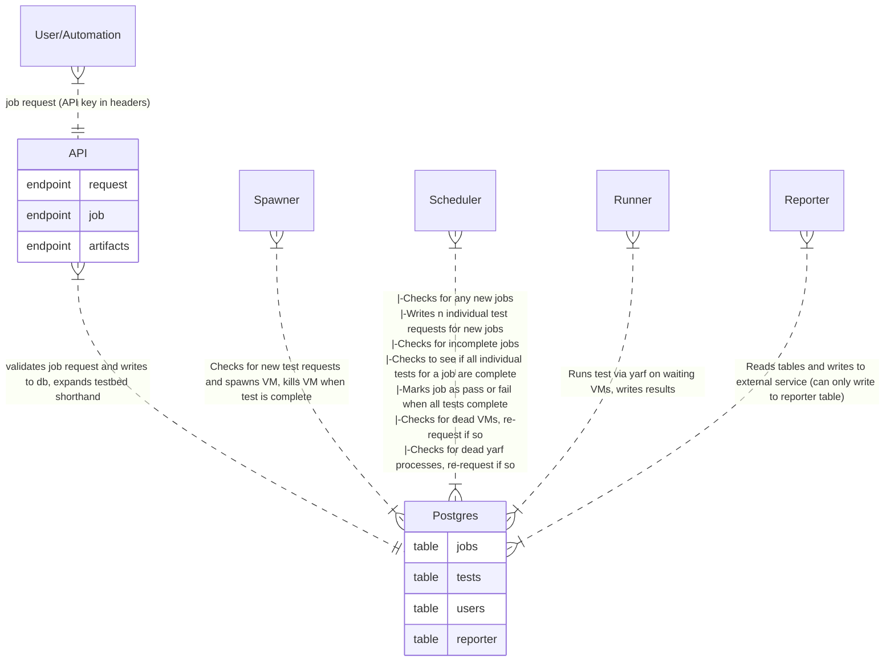
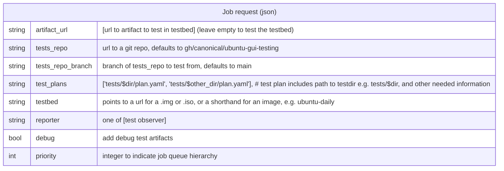
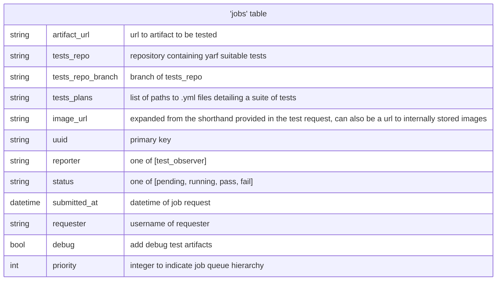
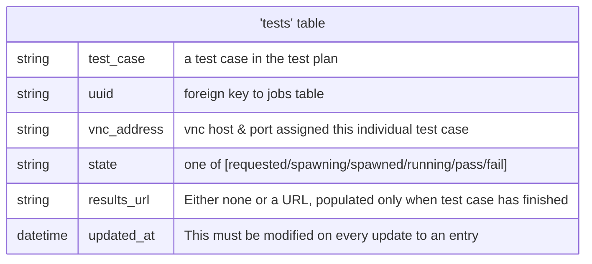
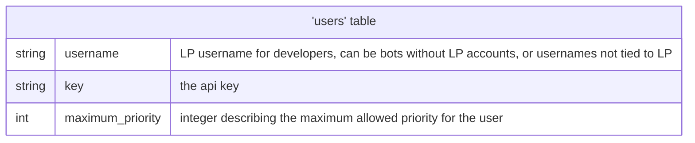
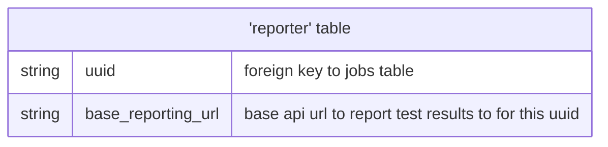

<!-- markdownlint-disable MD013 -->

# Basic Architecture and Functionality

## Entity Relationship Diagram

## Schemas

### Job Request Schema

## Database schemas

### 'jobs' table

### 'tests' table

### 'users' table

### 'reporter' table

